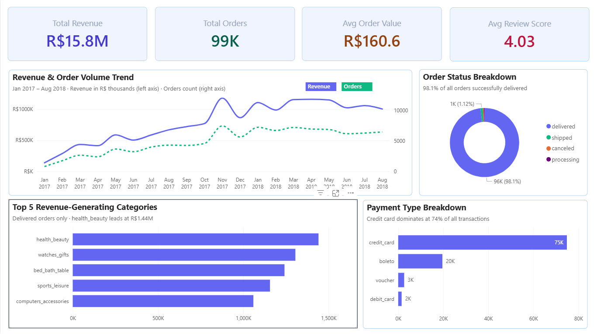
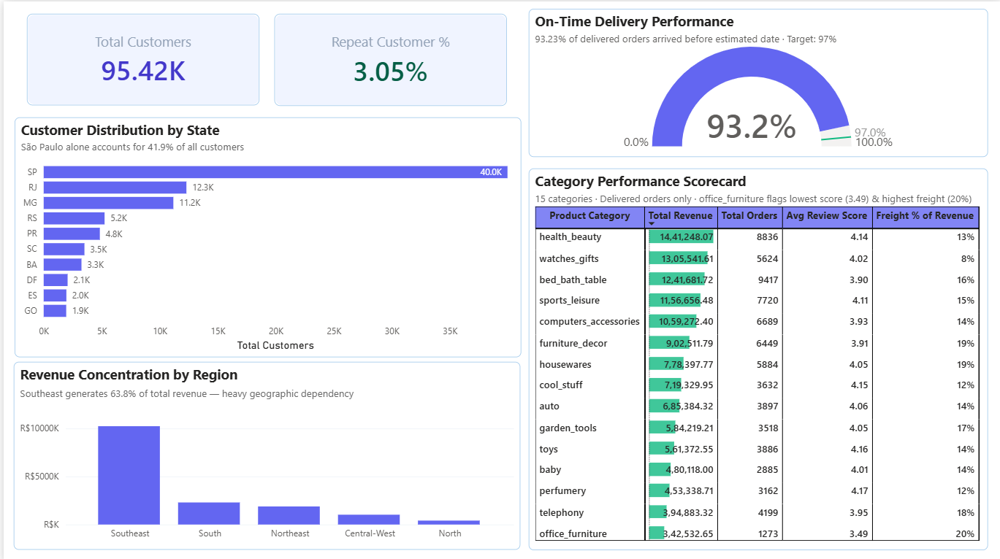

# 🛒 Olist E-Commerce Analytics Dashboard

A complete end-to-end data analytics project on the **Brazilian Olist e-commerce dataset**, covering data exploration, cleaning, feature engineering, and a 2-page interactive Power BI dashboard.

---

## 📊 Dashboard Preview

### Page 1 – Sales Overview


### Page 2 – Customer & Geographic Analysis


---

## 🔍 Key Business Insights

| Metric | Value |
|--------|-------|
| Total Revenue | R$ 15.8M |
| Total Orders | 99K |
| Avg Order Value | R$ 160.6 |
| Avg Review Score | 4.03 / 5 |
| Total Customers | 95.42K |
| Repeat Customer Rate | 3.05% |
| On-Time Delivery Rate | 93.2% |
| Top Category | Health & Beauty (R$ 1.44M) |
| Dominant Payment Method | Credit Card (74%) |
| Highest Revenue Region | Southeast (63.8% of total) |

---

## 🏗️ Project Structure

```
olist-analytics/
│
├── 📓 Notebooks
│   ├── 01_data_exploration.ipynb       # EDA – distributions, nulls, outliers
│   ├── 02_data_cleaning.ipynb          # Cleaning pipeline with logging
│   └── 03_feature_engineering.ipynb    # Feature creation for dashboard
│
├── 📊 Power BI
│   └── olist_Analysis.pbix             # 2-page interactive dashboard
│
├── 🖼️ dashboard_screenshots/
│   ├── Page1.png                 # Sales Overview page
│   └── Page2.png                 # Customer & Geographic Analysis page
│
├── 📄 data/
│   ├── raw/
│   │   └── *.csv                       # Original Olist CSV files from Kaggle
│   │
│   └── processed/
│       ├── cleaned_olist_data.csv      # Cleaned dataset (after data cleaning)
│       ├── olist_data.csv              # Final dataset with engineered features (for Power BI)
│       ├── cleaning_log.csv            # Log of all cleaning steps applied
│       └── exploration_summary.csv     # Summary from data exploration
│
├── DATA_QUALITY_ISSUES.md              # Documented data quality findings
│
└── README.md
```

> **Note:** Raw and processed CSV files are not included in the repo due to size. Download the original dataset from [Kaggle](https://www.kaggle.com/datasets/olistbr/brazilian-ecommerce) and follow the setup instructions below.

---

## 🛠️ Tech Stack

| Tool | Purpose |
|------|---------|
| Python 3.12 | Data processing |
| Pandas | Data manipulation |
| Jupyter Notebook | Analysis & documentation |
| Power BI Desktop | Dashboard & visualizations |
| Git & GitHub | Version control |

---

## ⚙️ Setup & Reproduction

### Prerequisites
- Python 3.8+
- Power BI Desktop (free, Windows only)
- Jupyter Notebook or JupyterLab

### 1. Clone the Repository
```bash
git clone https://github.com/hemantpatel-25/olist-analytics.git
cd olist-analytics
```

### 2. Install Python Dependencies
```bash
pip install pandas
pip install matplotlib
pip install seaborn
pip install jupyter
```

### 3. Download the Dataset
Download the **Brazilian E-Commerce Public Dataset by Olist** from Kaggle:  
🔗 https://www.kaggle.com/datasets/olistbr/brazilian-ecommerce

Place the downloaded CSV files inside a `data/raw/` folder.

### 4. Run the Notebooks (in order)

> **Important:** Update the file paths in each notebook to match your local directory structure before running.

```
01_data_exploration.ipynb   →  Explore the raw data
02_data_cleaning.ipynb      →  Clean and merge datasets → outputs cleaned_olist_data.csv
03_feature_engineering.ipynb →  Engineer features → outputs olist_data.csv (dashboard-ready)
```

### 5. Open the Dashboard
Open `olist_Analysis.pbix` in **Power BI Desktop** and update the data source path to point to your local `olist_data.csv`.

---

## 📐 Feature Engineering Summary

Three features were created to support the Power BI dashboard:

| Feature | Logic | Purpose |
|---------|-------|---------|
| `customer_region` | Maps Brazilian state codes to 5 regions | Geographic analysis |
| `customer_segment` | New (1 order) / Regular (2–3) / Loyal (4+) | Customer loyalty segmentation |
| `is_repeat_customer` | `order_count > 1` | Boolean flag for repeat buyers |

---

## 🧹 Data Cleaning Summary

| Step | Action | Reason |
|------|--------|--------|
| Drop missing IDs | Removed rows with missing critical IDs | Cannot analyze without identifiers |
| Fill missing category | Filled with `Unknown` | Preserve orders for analysis |
| Handle missing reviews | Created `has_review` flag | Not all customers leave reviews |
| Convert dates | Converted to datetime | Enable time-based analysis |
| Remove zero prices | Removed orders with price ≤ 0 | Data errors |
| Payment nulls | Filled with `unknown` / `0` | 3 affected rows |

**Final dataset:** 112,650 rows × 35 columns | 0 duplicates | 0 negative prices

---

## 📈 Dashboard Pages

### Page 1 – Sales Overview
- Revenue & Order Volume trend (Jan 2017 – Aug 2018)
- Order Status Breakdown (98.1% delivered)
- Top 5 Revenue-Generating Categories
- Payment Type Breakdown (credit card dominates at 74%)

### Page 2 – Customer & Geographic Analysis
- Customer Distribution by State (São Paulo: 41.9%)
- Revenue Concentration by Region (Southeast: 63.8%)
- On-Time Delivery gauge vs. 97% target
- Category Performance Scorecard (15 categories with revenue, orders, review score, freight %)

---

## ⚠️ Known Data Quirks

- **`customer_id` vs `customer_unique_id`:** In the raw Olist data, `customer_id` is a per-order reference (changes each order), not a true customer identifier. `customer_unique_id` (renamed `customer_id_unique` in this project) is the correct field for counting unique customers.
- **Undelivered orders (2.2%):** `delay_days`, `is_late`, and `actual_delivery_days` are NULL for non-delivered orders — this is expected and handled via the `is_delivered` flag.

---

## 📁 Data Source

**Brazilian E-Commerce Public Dataset by Olist**  
🔗 https://www.kaggle.com/datasets/olistbr/brazilian-ecommerce  
License: CC BY-NC-SA 4.0

---

## 👤 Author

**[Hemant Kumar Patel]**  
[LinkedIn](https://www.linkedin.com/in/hemant-kumar-patel25/) · [GitHub](https://github.com/hemantpatel-25)

---


